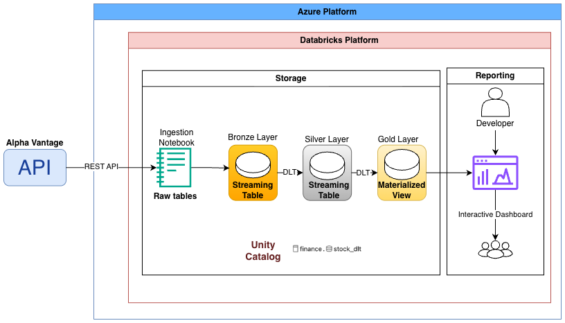

# Stock Market Data Pipeline with Delta Live Tables (DLT)

## Introduction
This project implements an end-to-end data engineering pipeline in Databricks using Delta Live Tables (DLT) and triggered streaming Medallion Architecture (Bronze → Silver → Gold).

Daily stock market data is ingested from the Alpha Vantage API, transformed into analytics-ready tables, and served to a SQL dashboard. The workflow is fully automated using Databricks Jobs.

## Architecture

- `transformations/transformation.py` → DLT pipeline code (bronze → silver → gold)

## Ingestion Layer
`01_ingestion_alpha_vantage` notebook
- Calls Alpha Vantage API(Handles API rate limits)
- Converts JSON to Spark DataFrame
<!--- Uses Delta MERGE for idempotent upserts(using `symbol + trading_date` as the key)-->
- Creates raw tables: `raw_stock_data`, `raw_company_info`

## Bronze Layer
- Streaming ingestion from raw tables
- Stored streaming tables `bronze_stock_data` and `bronze_company_info` in Unity Catalog

## Silver Layer
- Streaming transformations
- Data quality enforcement using DLT expectations
- Calculated metrics: `price_change` and `price_change_pct`
- SCD Type 2 handling for company metadata
<!--- SCD Type 1 handling for company metadata-->
- Srores atreaming tables: `silver_stock_data` and `silver_company_info`

## Gold Layer
`gold_daily_stock_summary`
- Joined stock + company data and created a materialized view
- Daily metrics ready for reporting
- Serves SQL interactive dashboard: `Stock Performance Dashboard.jpg`

## Orchestration
A Databricks Job, scheduled daily to automate 3 tasks: Ingestion notebook -> DLT pipeline execution -> Dashboard refresh (screenshot: `Stock_Data_DLT_Pipeline_job.png`)

## Future Improvements
- Implement **Auto Loader** for Scalable Ingestion: So, we can support Incremental file-based ingestion, schema evolution handling, large-scale historical backfills, and better production scalability
- Optimize the Gold table by adding **Partitioning** by trading_date, applying **Z-ORDER** BY symbol, enabling Delta table optimization and vacuum. So we can improve dashboard query performance, long time range scans, and reduce costs
- Enhance reliability by adding more **DLT expectations** (e.g., no missing dates per symbol), configuring pipeline **failure notifications**, and adding anomaly detection for extreme price changes

