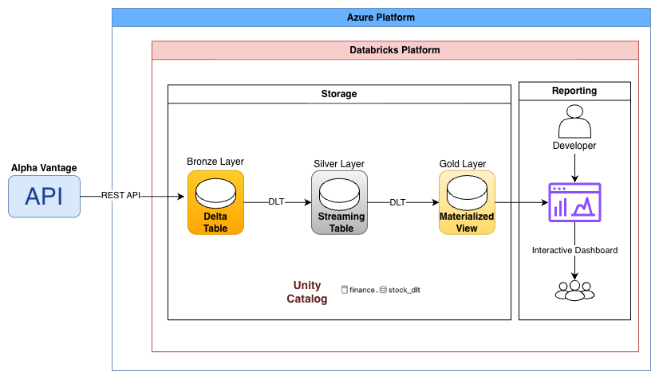

# Stock Market Data Pipeline with Delta Live Tables (DLT)

## Introduction
This project implements an end-to-end data engineering pipeline in Databricks using Delta Live Tables (DLT) and triggered streaming Medallion Architecture (Bronze → Silver → Gold).

Daily stock market data is ingested from the Alpha Vantage API, transformed into analytics-ready tables, and served to a SQL dashboard. The workflow is fully automated using Databricks Jobs.

## Architecture

- `transformations/transformation.py` → DLT pipeline code (bronze → silver → gold)

## Bronze Layer
- API calls fetch: Daily stock data, Company metadata
- Data is converted into Spark DataFrames and persisted in Delta tables.
- Stored bronze tables `bronze_stock_data` and `bronze_company_info` in Unity Catalog

## Silver Layer
- Streaming transformations of Bronze data
- Data quality enforcement using DLT expectations: `valid_price` -> price > 0, `valid_volume` -> volume >= 0
- Calculated metrics: `price_change` and `price_change_pct`
- SCD Type 2 handling for company metadata
- Stored as streaming tables: `silver_stock_data` and `silver_company_info`

## Gold Layer
`gold_daily_stock_summary`
- Joined stock + company data and created a materialized view
- Daily metrics ready for reporting
- Serves SQL interactive dashboard: `Stock-Analytics-Dashboard.jpg` with these charts:
    - Stock Price Trend
    - Daily Price Change %
    - Average Volume by Stock
    - Sector Distribution
    - Top Gainers

## Orchestration
A Databricks Job, scheduled daily to automate the full pipeline: DLT pipeline execution(bronze->silver->gold) -> Dashboard refresh (screenshot: `Stock_DLT_Pipeline.png`)

## Future Improvements
- Optimize the Gold table by adding **Partitioning** by trading_date, applying **Z-ORDER** BY symbol, enabling Delta table optimization and vacuum. So we can improve dashboard query performance, long time range scans, and reduce costs
- Enhance reliability by adding more **DLT expectations** (e.g., no missing dates per symbol), configuring pipeline **failure notifications**, and adding anomaly detection for extreme price changes
- Adding parameters for tickers so the ticker list can be changed without modifying the code.

