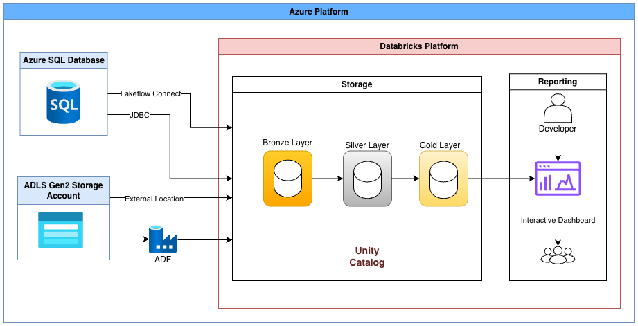

# Fraud Analytics Pipeline on Azure Databricks

This project builds an end-to-end Fraud Analytics **ELT Pipeline** using Microsoft Azure and Azure Databricks, following the Medallion Architecture (Bronze → Silver → Gold).

The solution covers:

- Multi-source data ingestion (SQL + JSON + Cloud Storage)

- ELT pipeline implementation in Databricks

- Workflow orchestration using Databricks Jobs

- Analytical dashboard built in Databricks SQL(screenshot: `Fraud-Analytics-Dashboard.png`)

The objective is to transform raw financial transaction data into a structured fraud analytics warehouse and create actionable fraud insights.

## Architecture



## Data Ingestion

1. Importing `transactions_data.csv` and `cards_data.csv` into **Azure SQL Database** (using Azure Data Studio to connect to SQL Server and importing data via import wizard)

2. Using **JDBC** to ingest `transactions_data.csv` from Azure Sql DB to Databricks

3. Using **Lakeflow Connect** to connect Databricks to Azure SQL Database for `cards_data.csv`. (Initially encountered errors related to the gateway cluster due to vCPU quota limitations on the free subscription, which required upgrading to Pay-As-You-Go.)

4. Uploading files(`users_data.csv`, `mcc_codes.json`, `train_fraud_labels.json`) in Azure Data Lake Storage, then creating **External Location** in Unity Catalog, to read directly from cloud storage(storage credential in UC was created to give grant permission to externa; location + config IAM roles in ADLS)

5. Using Azure Data Factory to move `mcc_codes.json` and `train_fraud_labels.json` into Databricks Delta tables. (Note: JSON files were not in a standard format, so ADF could not map them directly. Binary ingestion was not supported for Databricks, so files were first stored in ADLS and accessed via the external storage setup in Databricks.)

## Implementation
This project implements a Medallion Architecture in Databricks:

- Bronze Layer: Raw data ingested from Azure SQL and ADLS, stored as Delta tables with minimal transformation into `ws_banking_etl2.bronze`.

- Silver Layer: Cleaned, transformed, and enriched the data by casting columns to appropriate types, standardizing categorical fields, handling nulls, removing duplicates, and joining transactions, users, cards, MCC codes, and fraud labels into a unified transactional model stored as Delta tables in `ws_banking_etl2.silver`.

- Gold Layer: Aggregated analytics tables built for reporting and written to `ws_banking_etl2.gold`, including fraud trends, financial losses, user risk metrics, and behavioral insights.

This layered approach ensures data quality, scalability, and clear separation between raw data and business-ready analytics.

## Job Orchestration

A Databricks Job was created to orchestrate the full pipeline. Task flow: 
```
Bronze Notebook -> Silver Notebook -> Gold Notebook -> Dashboard Refresh.
```
 The published dashboard automatically reflects updated data after Gold tables refresh. (screenshot: `Fraud-analysis-job.png`)

## Future Improvements

- Add streaming ingestion
- Implement Delta Live Tables (DLT)
- Add data quality checks