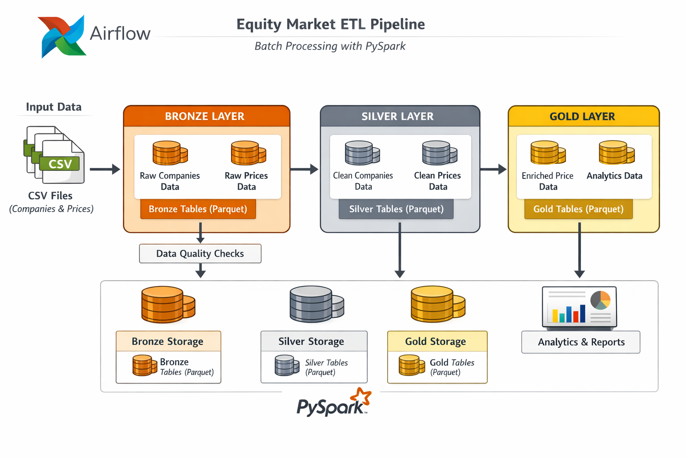

# Equity Market ETL Pipeline

## Overview

This project implements a **production-style batch data engineering pipeline** for equity market data using a **Medallion Architecture (Bronze → Silver → Gold)**. It is designed to demonstrate real-world data engineering skills including ingestion, transformation, data quality enforcement, orchestration, testing, and operational best practices.

The pipeline ingests raw equity price data and company metadata, cleans and standardizes it, enriches it with analytical features, and produces curated datasets suitable for downstream analytics and reporting.

## Key Features
- Columnar storage with Parquet
- Partitioned datasets by ticker
- Progressive data quality enforcement
- Airflow orchestration (Dockerized)

## Use Case
Analytics-ready datasets for equity selection, sector analysis, and risk metrics.

## Architecture

### Medallion Layers

```
Raw Data → Bronze → Silver → Gold
```



## Data Sources

- **Equity Prices**: Daily stock price data (CSV)
- **Company Metadata**: Company name, sector, industry, exchange, market cap

These datasets are treated as **immutable inputs** and are never modified directly.

## Configuration

All paths and Spark settings are centralized using environment-aware configuration.

### `src/utils/config.py`

This design ensures:
- Portability (local, Docker, CI, cloud)
- No hardcoded paths
- Easy future containerization

## Spark Processing

- PySpark used for all transformations
- Schema enforcement via casting
- Deduplication on business keys
- Partitioning by `ticker` for price datasets

Spark sessions are created centrally via `get_spark()` to ensure consistent configuration.

## Data Quality Framework

Custom data quality checks are implemented in:

```
src/validation/data_quality_checks.py
```

### Features

- Required column validation
- Null checks on critical fields
- Numeric range validation
- Uniqueness constraints
- Business rule enforcement

### Error Handling

```python
class DataQualityError(Exception):
    pass
```

Any violation raises a `DataQualityError`, causing the Airflow task to fail and retry. (instead of silent drops)

## Airflow Orchestration

### DAG: `equity_market_etl`

The pipeline is orchestrated using **Apache Airflow** with PythonOperators.

### DAG Flow

```
Ingest (Bronze)
   ↓
Transform (Silver)
   ↓
Enrich & Aggregate (Gold)
   ↓
Data Quality Checks
```

### Operational Features

| Feature | Implementation |
|------|---------------|
| Retry logic | `retries=3`, `retry_delay=5min` |
| Task dependencies | Explicit DAG graph |
| Failure alerts | Callback logging + email support |
| Idempotency | Overwrite writes + deduplication |
| Backfill | Manual execution-date backfill |
| Parallelism control | `max_active_runs=1` |


## Testing Strategy

### 1. Unit Tests

**Example:** `tests/unit/test_config.py`

- Validates configuration defaults
- Ensures path formats are correct

---

### 2. Integration Tests

**Silver Layer**

- Confirms Parquet outputs exist
- Validates schema and non-empty datasets

**Gold Layer**

- Verifies enriched datasets
- Checks analytics aggregates

---

### 3. Data Quality Tests

Located in:
```
tests/data_quality/test_dq_checks.py
```

- Executes Bronze, Silver, and Gold checks
- Skipped automatically if data is not present
- Suitable for CI/CD pipelines

---

## How to Run

### 1. Create Virtual Environment

```bash
python -m venv venv
source venv/bin/activate
pip install pyspark
pip install pytest

export AIRFLOW_VERSION=2.8.3
export PYTHON_VERSION=3.10

pip install "apache-airflow==${AIRFLOW_VERSION}" \
  --constraint "https://raw.githubusercontent.com/apache/airflow/constraints-${AIRFLOW_VERSION}/constraints-${PYTHON_VERSION}.txt"
```

### 2. Set Environment Variables

```bash
export AIRFLOW_HOME=$(pwd)/airflow
export PYTHONPATH=$(pwd)
```

### 3. Run Airflow

```bash
airflow db init
airflow users create \
  --username admin \
  --firstname Admin \
  --lastname User \
  --role Admin \
  --email admin@example.com

airflow webserver
airflow scheduler
```

Trigger the DAG from the Airflow UI.

---

## How to Run on Docker

```bash
# Start all services
docker compose up -d
# Initialize the Airflow metadata database
docker compose exec airflow-webserver airflow db init
# Create an Airflow admin user
docker compose exec airflow-webserver airflow users create \
  --username admin \
  --firstname Admin \
  --lastname User \
  --role Admin \
  --email admin@example.com \
  --password admin
airflow webserver
airflow scheduler
#  log in to the Airflow UI & Spark Master UI
http://localhost:8080
http://localhost:8081
# Stopping the Project
docker up down
```
---

## Future Enhancements

- Cloud object storage (S3 / ADLS)
- Incremental processing
- CI/CD pipeline
