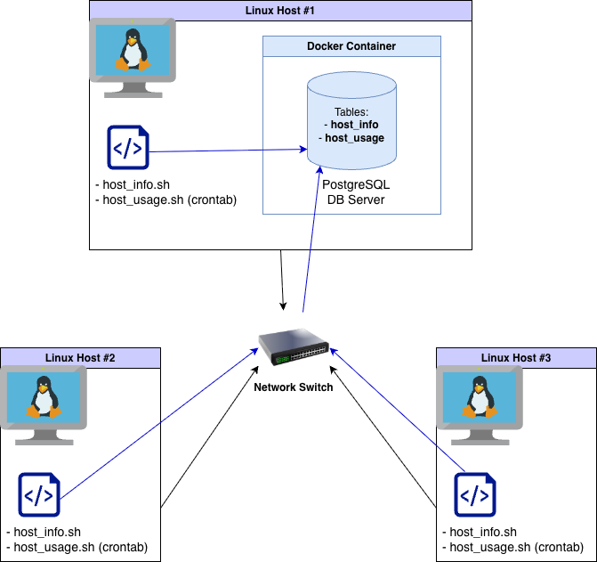

# Linux Cluster Monitoring Agent

## Introduction
The Linux Cluster Monitoring Agent is an automated solution for collecting and storing hardware specifications and resource usage data across multiple Linux servers. It collects real-time metrics, such as CPU and memory usage, and stores them in a centralized PostgreSQL database to support effective cluster monitoring. The Linux Cluster Administration (LCA) team can use this data to generate reports and manage server performance efficiently. The project leverages **Bash, Docker, PostgreSQL, cron, and Git** technologies for Linux system administration, scripting, and DevOps automation. The project's scalable design allows multiple nodes to report to a single database, providing real-time visibility into cluster performance through simple SQL queries, enabling data-driven analysis and informed decision-making.


## Quick Start

Follow the steps below to set up and run the Linux Cluster Monitoring Agent on your system:

```bash
# 1. Create a Docker container for the PostgreSQL instance
./scripts/psql_docker.sh create [db_username] [db_password]

# 2. Start the PostgreSQL container
./scripts/psql_docker.sh start

# 3. Create the database tables
psql -h localhost -U [db_username] -d host_agent -f sql/ddl.sql

# 4. Insert hardware specifications data into the database
./scripts/host_info.sh localhost 5432 host_agent [db_username] [db_password]

# 5. Insert hardware usage data into the database
./scripts/host_usage.sh localhost 5432 host_agent [db_username] [db_password]

# 6. Set up a cron job to collect usage data every minute
crontab -e
* * * * * bash /path/to/host_usage.sh localhost 5432 host_agent [db_username] [db_password] > /tmp/host_usage.log 2>&1
```

## Implementation

### Architecture

The Linux Cluster Monitoring Agent is designed to monitor and record system information from multiple Linux nodes in a distributed cluster environment. Each node runs a Bash-based monitoring agent that collects both hardware and usage metrics. The collected data is sent to a centralized PostgreSQL database running inside a Docker container on the primary host.

The system architecture consists of three Linux hosts: host1, host2, and host3, which are internally connected through a switch. They are all connected to a single PostgreSQL database container. The `host_info.sh` script runs once to capture static hardware information, while `host_usage.sh` runs periodically via cron to record real-time CPU and memory usage. This setup enables centralized monitoring, data persistence, and reporting for efficient cluster management and resource planning.



### Scripts

This project includes several Bash scripts that automate the setup and monitoring process for the Linux Cluster Monitoring Agent.

#### 1. `psql_docker.sh`

Manages the lifecycle of the PostgreSQL container used to store monitoring data.

```bash
# Create a new PostgreSQL container
./scripts/psql_docker.sh create [db_username] [db_password]

# Start the PostgreSQL container
./scripts/psql_docker.sh start

# Stop the PostgreSQL container
./scripts/psql_docker.sh stop
```

#### 2. `host_info.sh`

Collects and stores static hardware information from a host machine, including CPU, memory, and disk details. Execute once per server.

```bash
./scripts/host_info.sh localhost 5432 host_agent [db_username] [db_password]
```

#### 3. `host_usage.sh`

Gathers real-time CPU and memory usage metrics and inserts them into the PostgreSQL database. Designed to run periodically via cron.

```bash
./scripts/host_usage.sh localhost 5432 host_agent [db_username] [db_password]
```

#### 4. `crontab`

Automates data collection by running `host_usage.sh` every minute.

```bash
* * * * * bash /path/to/host_usage.sh localhost 5432 host_agent [db_username] [db_password] > /tmp/host_usage.log 2>&1
```

#### 5. `queries.sql`

This file contains SQL queries for business/reporting use cases, so, the system administrators can optimize service performance.

It helps answer business questions such as:

- Compare average memory usage between host2 and host3 over the past 7 days.

- Which 3 hosts consumed the most memory in the last 24 hours?

- Which hosts have the lowest CPU or memory usage?


## Database Modeling

The project uses a PostgreSQL database named **host_agent** to store both static hardware information in the host_info table and dynamic usage data collected from each Linux host in the `host_usage` table. Each record in `host_usage` references a single host in `host_info`, forming a one-to-many relationship where one host can have multiple usage records over time.

### 1. host_info

Stores static hardware and system information for each node in the cluster. Each host is uniquely identified by its hostname.

| Column Name      | Data Type | Description                                    |
| ---------------- | --------- | ---------------------------------------------- |
| id               | SERIAL    | Primary key that uniquely identifies each host |
| hostname         | VARCHAR   | Name of the host machine (unique)              |
| cpu_number       | INT2      | Number of CPU cores                            |
| cpu_architecture | VARCHAR   | CPU architecture type (e.g., x86_64)           |
| cpu_model        | VARCHAR   | Model name of the CPU                          |
| cpu_mhz          | FLOAT8    | CPU clock speed in MHz                         |
| l2_cache         | INT4      | L2 cache size in KB                            |
| timestamp        | TIMESTAMP | Time when the host information was recorded    |
| total_mem        | INT4      | Total memory available on the host (in MB)     |

### 2. host_usage

Stores real-time system usage metrics collected periodically from each host. It is linked to `host_info` through a foreign key.

| Column Name    | Data Type | Description                                 |
| -------------- | --------- | ------------------------------------------- |
| timestamp      | TIMESTAMP | Time when the usage data was collected      |
| host_id        | SERIAL    | Foreign key referencing host_info(id)       |
| memory_free    | INT4      | Amount of free memory (in MB)               |
| cpu_idle       | INT2      | Percentage of CPU time spent idle           |
| cpu_kernel     | INT2      | Percentage of CPU time spent in kernel mode |
| disk_io        | INT4      | Disk I/O activity value                     |
| disk_available | INT4      | Available disk space (in MB)                |

## Test

To ensure the Linux Cluster Monitoring Agent functions correctly, each component of the system was tested individually.

### Bash Scripts Testing:

- **psql_docker.sh:** Verified Docker container creation, start, and stop. Confirmed accessibility via `psql`.

```bash
# Confirm the database is accessible from the host
psql -h localhost -U [db_username] -d host_agent -c "\dt"
```

- **host_info.sh:** Executed on each Linux node, confirmed all hardware specs correctly inserted into `host_info` by running:

```bash
psql -h localhost -U postgres -d host_agent -c "SELECT * FROM host_info;"
 ```

- **host_usage.sh:** Executed manually and via cron; verified real-time CPU and memory usage inserted into `host_usage` with correct timestamps and host associations.

```bash
psql -h localhost -U postgres -d host_agent -c "SELECT * FROM host_usage;"
 ```

### Database Testing:

- Verified table creation via `ddl.sql` and schema inspection, using `\dt` command in psql.

- Checked primary and foreign key constraints between `host_info` and `host_usage`, using `\d` command in psql.

- Executed sample queries to ensure correct aggregation of usage statistics.

**Result:**
All scripts executed as expected. Data was correctly inserted into the PostgreSQL database, timestamps were accurate, and the system continuously monitored all hosts via cron jobs.

## Deployment

The Linux Cluster Monitoring Agent is deployed using **Docker, crontab**, and **GitHub**, allowing easy installation and continuous operation across multiple Linux hosts.

**Deployment Steps:**

**1. GitHub Repository:**

- All project files are managed in a Git repository for version control, using the **Gitflow** strategy.

**2. PostgreSQL Deployment with Docker:**

- Database runs inside a Docker container(verify running containers: `docker ps`), with the `ddl.sql` script creating **host_info** and **host_usage** tables.

**3. Scripts Execution:**

- `host_info.sh` provides static hardware data.

- `host_usage.sh` scheduled with cron for continuous monitoring.

**4. Crontab Setup:**

- Scheduled to run `host_usage.sh` every minute.

- Output logs redirected to `/tmp/host_usage.log`.


This setup provides a fully automated monitoring system with minimal manual intervention.

## Improvements

While fully functional, the project can be enhanced in the following areas:

- **Handle Hardware Updates:** Automatically detect changes in hardware and update `host_info` without manual intervention.

- **Enhanced Monitoring Metrics:** Include additional metrics such as network bandwidth, GPU usage, or temperature sensors.

- **Alerting and Notifications:** Integrate notifications (e.g., email, Slack) when usage exceeds thresholds.

- **Dashboard and Visualization:** Build a web-based or CLI dashboard to visualize historical data trends.

- **Error Handling and Logging:** Improve robustness with detailed error handling, logging, and retry mechanisms.
